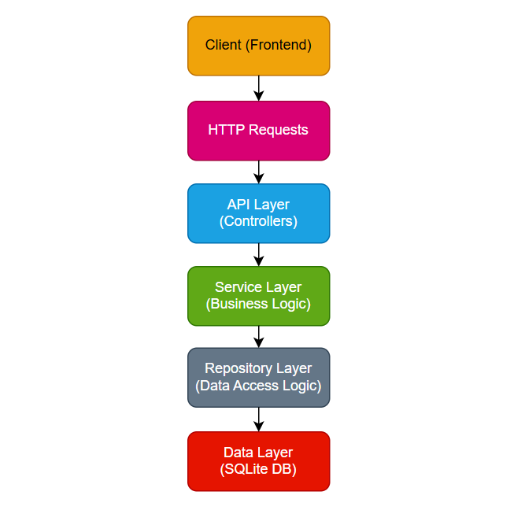

# Blog API Project

## Description

The project uses SQLite as its database and uses Serilog for structured logging, ensuring that critical actions and errors are logged effectively. The project is also Dockerized for ease of deployment, making it simple to run in any environment. Additionally, comprehensive validation is applied to ensure data integrity, and meaningful error messages are returned to the client, enhancing the API's usability

## Table of Contents

- ✨ [Features](#-features)
- 💻 [Technologies Used](#-technologies-used)
- 🏛️ [Project Architecture](#-project-architecture)
- 🧠 [Design Decisions](#-design-decisions)
- 🛡️ [Validation, Error Handling, and Logging](#-validation-error-handling-and-logging)
- ⚙️ [Project Setup](#-project-setup)
- 📦 [Nugget Packages](#-nugget-packages)
- ➕ [Additional Features](#-additional-features)

---

## ✨ Features

- 📝 **CRUD Operations**: Provides full CRUD (Create, Read, Update, Delete) functionality for blog posts, following to RESTful API conventions.
- 📦 **SQLite Integration**: Uses SQLite as the database for simplicity and portability, making it easy to set up and run locally or in a container.
- ✅ **Data Validation**: Ensures that all inputs meet specified validation rules, such as validating the author's name and mandatory fields.
- ⚠️ **Error Handling**: Implements error handling, providing meaningful error responses and ensuring the API remains robust.
- 📊 **Logging with Serilog**: Uses Serilog to log all actions as well as errors and warnings, providing structured and detailed logs for easier debugging and monitoring.
- 🐳 **Dockerized**: Includes Docker support, enabling easy deployment and environment setup for consistent application behavior across different systems.
- 📄 **Swagger Documentation**: Uses Swagger for API documentation, providing an interactive interface for testing API endpoints directly in the browser.

---

## 💻 Technologies Used

- ⚙️ **ASP.NET Core 8**: The primary framework used to build the Web API.
- 🗄️ **Entity Framework Core**: An ORM (Object-Relational Mapper) used to interact with the SQLite database in an object-oriented way.
- 💾 **SQLite**: Lightweight, file-based database chosen for simplicity and ease of setup.
- 🐳 **Docker**: Containerization tool that enables easy deployment and environment consistency across different platforms.
- 🛠️ **Serilog**: Structured logging library used to log important actions and errors, enhancing debugging and monitoring.
- 📄 **Swagger / Swashbuckle**: Used for auto-generating API documentation, providing an interactive UI to test API endpoints.
- ✅ **xUnit**: Unit testing framework for validating API functionality and ensuring reliability.

---

## 🏛️ Project Architecture

The  follows a layered architecture that promotes separation of concerns and adheres to SOLID principles, ensuring that each layer has a specific responsibility. This architecture simplifies testing, maintenance, and scalability.

### Layers Overview

The **Blog API Project** follows a layered structure to enhance modularity and maintainability.

At its core, the **API layer** consists of controllers that handle HTTP requests and route them to the appropriate services. Controllers manage request validation and return structured HTTP responses to the client, acting as an entry point to the API.

The **Service layer** contains the core business logic of the application. It interacts with the repository layer through interfaces, adhering to SOLID principles. This design ensures that services can perform data operations (CRUD) using repositories and dependency injection is used here to manage dependencies on repositories.

The **Repository layer** manages data access and persistence. This layer isolates database operations in classes that interact directly with `BlogDbContext`, an Entity Framework Core context that maps `BlogPost` models to database tables. Implements the Repository Pattern to interact with the data layer. This layer isolates the direct database access and provides methods to query, add, update, and delete data, all through BlogDbContext using Entity Framework Core.

The **Data layer** is backed by an SQLite database, which stores blog post data in tables mapped to C# models via Entity Framework Core. This lightweight relational database serves as the persistent storage for the project.

Additionally, the **Model layer** defines the data structures used throughout the API, including validation attributes to enforce data integrity, while the **Utilities layer** includes logging and error-handling mechanisms (e.g., Serilog) to capture events and errors, supporting monitoring. Logging, error handling, and unit testing are included to enhance reliability, with Docker containerization as an optional feature to facilitate deployment.

### Architecture Diagram



---

## 🧠 Design Decisions

Throughout the development of the **Blog API Project**, several key design decisions were made to ensure maintainability, scalability, and adherence to best practices. Below are some of the main considerations:

### 1. Layered Architecture

A layered architecture was chosen to separate concerns and responsibilities across different layers:
   - **Controllers** handle request validation and response.
   - **Services** encapsulate the business logic and orchestrate data interactions.
   - **Repositories** manage data access, keeping data logic isolated from other parts of the application.
   - **Models** serve as data contracts, defining the structure and rules for each entity.

   This approach enables each layer to be independently tested, developed, and maintained, making the project more manageable.

### 2. Dependency Injection (DI)

The project uses **Dependency Injection** extensively, allowing services and repositories to be injected where needed rather than being tightly coupled to any specific implementation. DI enhances testability and modularity, enabling easier swapping or modification of individual components.

### 3. Data Validation with Annotations

Data annotations were selected to enforce validation rules directly in the **Model** layer. This decision simplifies validation checks in the API, allowing automatic validation via attributes like `[Required]` and `[RegularExpression]` (for example, ensuring the `Author` name contains only letters).

### 4. Error Handling and Logging

To ensure robust error handling:
   - **Try-catch** blocks and specific error messages are used throughout service and repository layers.
   - **Serilog** was chosen for logging due to its structured logging capabilities, making it easier to track and monitor application events.
    - **Global Exception Handling** could also be added to further streamline error handling.
These practices enhance the reliability of the API, making it easier to identify and resolve issues in production environments.

### 5. Database Choice: SQLite

**SQLite** was chosen as the database for its lightweight and file-based nature, which simplifies local development and deployment in Docker. While SQLite is limited in scalability for high-traffic production use, it is ideal for the scope of this project and can be easily swapped out for a more robust DBMS if needed.

### 6. Docker for Deployment

Dockerization was implemented to make the API easy to deploy and run in isolated environments. This approach ensures consistency across development, testing, and production environments, reducing issues related to configuration or environment setup.

### 7. Use of Swagger for API Documentation

**Swagger** was integrated for automatic API documentation. Swagger provides an interactive interface to test the API endpoints, which is valuable for both development and client testing.

---

## 🛡️ Validation, Error Handling, and Logging

This project incorporates comprehensive validation, error handling, and logging practices to ensure robust API functionality and maintain data integrity.

### 1. Validation

Data validation is enforced through **Data Annotations** in the model layer, which provide a simple yet effective way to validate user inputs:
   - **Required Attributes**: Key fields, such as `Title` and `Content`, are marked as required to prevent incomplete data entries.
   - **Custom Regular Expressions**: The `Author` field includes a regular expression check to ensure it contains only alphabetic characters and spaces, enforcing a standard format.
   - **Model State Validation**: Each controller action checks `ModelState.IsValid` to confirm that input data conforms to the specified validation rules. If validation fails, a `400 Bad Request` response with detailed validation errors is returned to the client.

### 2. Error Handling

Robust error handling is implemented throughout the project to manage unexpected situations and provide meaningful feedback to the client:
   - **Try-Catch Blocks**: Each service and repository method is wrapped in a `try-catch` block to capture any potential errors, particularly those related to database operations.
   - **Custom Error Messages**: Meaningful error messages are provided for specific scenarios, such as “Post not found” when attempting to update or delete a non-existent post.
   - **Global Exception Handling**: A global exception handler could be added to further streamline error handling, ensuring that any unhandled exceptions are logged and a generic error message is returned to the client.

### 3. Logging with Serilog

**Serilog** is integrated to provide structured and detailed logging throughout the API. This helps with tracking actions, diagnosing issues, and monitoring the application:
   - **Action Logging**: Key actions (e.g., creating, updating, and deleting blog posts) are logged with informative messages to track user interactions.
   - **Error Logging**: Errors caught in `catch` blocks are logged with stack traces to assist in diagnosing issues.
   - **Structured Logs**: Logs are structured to include relevant information (such as post IDs) to enhance readability and filter logs more easily.

With these measures in place, the API is well-equipped to handle user errors, unexpected issues, and critical application events, ensuring a high level of stability and reliability.

---

## ⚙️ Project Setup

Follow these steps to set up and run the **Blog API Project** locally or in a containerized environment.

### Prerequisites

- [.NET SDK](https://dotnet.microsoft.com/download) (version 6.0 or later)
- [Docker](https://www.docker.com/get-started) (for containerized deployment)
- [SQLite](https://www.sqlite.org/download.html) (optional, if you want to inspect the database directly)

### Steps to Set Up Locally

1. **Clone the Repository**

   ```bash
   git clone https://github.com/yourusername/BlogApiProject.git
   cd BlogApiProject
   ```

2. **Install Dependencies**

   Navigate to the project directory and restore dependencies:

   ```bash
   dotnet restore
   ```

3. **Configure Database**

   Ensure that the `appsettings.json` file is configured with the correct SQLite connection string. By default, it will create a `blog.db` file in the project directory.

4. **Run Database Migrations**

   Apply migrations to set up the database schema:

   ```bash
   dotnet ef database update
   ```

5. **Run the Application**

   Start the application using the following command:

   ```bash
   dotnet run
   ```

   The API will be available at `https://localhost:5001` (or `http://localhost:5000`).

6. **Access Swagger Documentation**

   Once the API is running, you can access Swagger documentation at:

   ```
   https://localhost:5001/swagger
   ```

### Running with Docker

1. **Build Docker Image**

   Build the Docker image for the application:

   ```bash
   docker build -t blog-api .
   ```

2. **Run Docker Container**

   Start the container with the following command:

   ```bash
   docker run -p 5000:80 blog-api
   ```

   The API will be accessible at `http://localhost:5000`.

---

Here’s the **Packages** section in README format:

---

## 📦 Nugget Packages

The **Blog API Project** utilizes several **NuGet packages** to streamline development and enhance functionality. Below is a list of the key packages and their purposes:

- **Microsoft.EntityFrameworkCore.Sqlite**: Provides SQLite support for Entity Framework Core, enabling the API to use SQLite as its database.

- **Microsoft.EntityFrameworkCore.Tools**: Adds tools for working with Entity Framework Core in the CLI, such as generating migrations and updating the database.

- **Serilog.AspNetCore**: Integrates Serilog for structured logging within the ASP.NET Core application, providing detailed logs for actions and errors.

- **Serilog.Sinks.Console**: Enables logging to the console, making it easy to view logs while the application is running.

- **Serilog.Sinks.File**: Allows logs to be written to a file, creating a persistent record of actions and errors for later analysis.

- **Swashbuckle.AspNetCore**: Adds Swagger support to auto-generate API documentation and create an interactive UI for testing API endpoints.

- **xUnit**: A popular testing framework for .NET, used to create unit tests for the project to ensure code reliability and functionality.

Each of these packages plays a crucial role in the functionality, reliability, and usability of the API, helping to enforce best practices and improve developer experience.

---

Here’s the **Additional Features** section in README format:

---

## ➕ Additional Features

In addition to core functionality, the **Blog API Project** includes several extra features that enhance usability, maintainability, and ease of deployment.

- **Docker Support**: The API is fully Dockerized, allowing easy deployment across different environments with consistent behavior. This enables the application to be run in a container with minimal configuration, making it ideal for cloud deployment.

- **Swagger Documentation**: Swagger is integrated to auto-generate API documentation and provide an interactive interface at `/swagger`. This interface allows users to test endpoints directly, making it easier for developers and users to understand the available functionality.

- **Data Validation and Integrity**: Extensive use of data annotations ensures that incoming data adheres to specified rules (e.g., no numbers in the `Author` field). This validation prevents incorrect or incomplete data from being processed, maintaining data integrity.

- **Centralized Logging with Serilog**: All actions, requests, and errors are logged using Serilog. This structured logging helps with debugging and provides valuable insights into the API’s performance and usage patterns.

- **Comprehensive Error Responses**: The API includes meaningful error responses and status codes, enabling users to understand issues more easily. For example, if a requested blog post is not found, a `404 Not Found` response is returned with a clear message.

These additional features contribute to a well-rounded API that’s easy to deploy, monitor, and use, meeting both functional and non-functional requirements effectively.

---