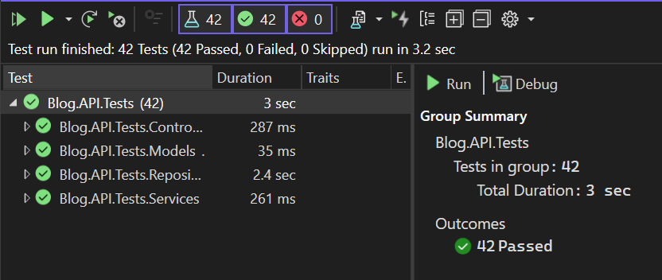

# Blog API Project
## Description

The project uses SQLite as its database and uses Serilog for structured logging, ensuring that critical actions and errors are logged effectively. The project is also Dockerized for ease of deployment, making it simple to run in any environment. Additionally, comprehensive validation is applied to ensure data integrity, and meaningful error messages are returned to the client, enhancing the API's usability

## Table of Contents

- ✨ [Features](#-features)
- 💻 [Technologies Used](#-technologies-used)
- 🏛️ [Project Architecture](#️-project-architecture)
- 🧠 [Design Decisions](#-design-decisions)
- 🛡️ [Validation, Error Handling, and Logging](#️-validation-error-handling-and-logging)
- ⚙️ [Project Setup](#️-project-setup)
- 🧪 [Testing Strategy](#-testing-strategy)
- 📦 [Nugget Packages](#-nugget-packages)
- ➕ [Additional Features](#-additional-features)
- 🏁 [Conclusion](#-conclusion)

---

## ✨ Features

- 📝 **CRUD Operations**: Provides full CRUD (Create, Read, Update, Delete) functionality for blog posts, following to RESTful API conventions.
- 📦 **SQLite Integration**: Uses SQLite as the database for simplicity and portability, making it easy to set up and run locally or in a container.
- ✅ **Data Validation**: Ensures that all inputs meet specified validation rules, such as validating the author's name and mandatory fields.
- ⚠️ **Error Handling**: Implements error handling, providing meaningful error responses and ensuring the API remains robust.
- 📊 **Logging with Serilog**: Uses Serilog to log all actions as well as errors and warnings, providing structured and detailed logs for easier debugging and monitoring.
- 🐳 **Dockerized**: Includes Docker support, enabling easy deployment and environment setup for consistent application behavior across different systems.
- 📄 **Swagger Documentation**: Uses Swagger for API documentation, providing an interactive interface for testing API endpoints directly in the browser.

---

## 💻 Technologies Used

- ⚙️ **ASP.NET Core 8**: The primary framework used to build the Web API.
- 🗄️ **Entity Framework Core**: An ORM (Object-Relational Mapper) used to interact with the SQLite database in an object-oriented way.
- 💾 **SQLite**: Lightweight, file-based database chosen for simplicity and ease of setup.
- 🐳 **Docker**: Containerization tool that enables easy deployment and environment consistency across different platforms.
- 🛠️ **Serilog**: Structured logging library used to log important actions and errors, enhancing debugging and monitoring.
- 📄 **Swagger / Swashbuckle**: Used for auto-generating API documentation, providing an interactive UI to test API endpoints.
- ✅ **xUnit**: Unit testing framework for validating API functionality and ensuring reliability.

---

## 🏛️ Project Architecture

The  follows a layered architecture that promotes separation of concerns and adheres to SOLID principles, ensuring that each layer has a specific responsibility. This architecture simplifies testing, maintenance, and scalability.

### Layers Overview

The **Blog API Project** follows a layered structure to enhance modularity and maintainability.

- At its core, the **API layer** consists of controllers that handle HTTP requests and route them to the appropriate services. Controllers manage request validation and return structured HTTP responses to the client, acting as an entry point to the API.

- The **Service layer** contains the core business logic of the application. It interacts with the repository layer through interfaces, adhering to SOLID principles. This design ensures that services can perform data operations (CRUD) using repositories and dependency injection is used here to manage dependencies on repositories.

- The **Repository layer** manages data access and persistence. This layer isolates database operations in classes that interact directly with `BlogDbContext`, an Entity Framework Core context that maps `BlogPost` models to database tables. Implements the Repository Pattern to interact with the data layer. This layer isolates the direct database access and provides methods to query, add, update, and delete data, all through BlogDbContext using Entity Framework Core.

- The **Data layer** is backed by an SQLite database, which stores blog post data in tables mapped to C# models via Entity Framework Core. This lightweight relational database serves as the persistent storage for the project.

- Additionally, the **Model layer** defines the data structures used throughout the API, including validation attributes to enforce data integrity, while the **Utilities layer** includes logging and error-handling mechanisms (e.g., Serilog) to capture events and errors, supporting monitoring. Logging, error handling, and unit testing are included to enhance reliability, with Docker containerization as an optional feature to facilitate deployment.

### Architecture Diagram


---

## 🧠 Design Decisions

The Blog API Project was designed with careful consideration of best practices and maintainability. Here are some key design decisions made to ensure that the API is robust, scalable, and user-friendly:

### 1. Layered Architecture

A layered architecture was chosen to separate responsibilities across different layers:
   - **Controllers** handle request validation and response.
   - **Services** encapsulate the business logic and manage data operations through repositories.
   - **Repositories** manage data access, keeping data logic isolated from other parts of the application.
   - **Models** serve as data templates, defining the structure and rules for each entity.
   - **DTOs (Data Transfer Objects)** separate input/output models from the core domain models, adding a layer of abstraction for better API control.
      
This approach enables each layer to be independently tested, developed, and maintained, making the project more manageable.

### 2. Use of Data Transfer Objects (DTOs)

DTOs were introduced to facilitate and secure data flow between the client and server:
   - **BlogPostCreateDto**: Used when creating a new blog post, this DTO includes only the fields necessary for creation, preventing unintended fields from being set.
   - **BlogPostUpdateDto**: Used to update an existing blog post, restricting updates only to the `Title`, `Content`, and `Author` fields, while preventing updates to fields like `Id` and `PublishedDate` to ensure data integrity.
   
   

DTOs allows better control over which data is exposed to clients and what data clients can modify.

### 3. Restricted Updates on Certain Fields

Certain fields, such as `Id` and `PublishedDate`, are intentionally restricted in update operations:
   - **Id**: The primary identifier for each blog post, the `Id` field should remain unchanged to maintain database integrity and prevent issues with references.
   - **PublishedDate**: This field is intended to reflect the creation date and is automatically set during creation. Locking it prevents tampering and maintains the integrity of the timeline for posts.

Restricting updates on these fields helps maintain a consistent record of each blog post’s history and avoids unintended data modifications.

### 2. Dependency Injection (DI)

Dependency Injection is used throughout the project to inject services and repositories where needed, rather than hard-coding dependencies:
   - **Advantages**: It enhances testability, modularity, and flexibility, allowing individual components to be modified without impacting the rest of the codebase.
   - **Implementation**: By registering dependencies in the `Program.cs` file, services and repositories are made available to the controllers and other layers, promoting loose coupling.

### 3. Data Validation with Annotations

Data annotations were selected to enforce validation rules directly in the **Model** layer. This decision simplifies validation checks in the API, allowing automatic validation via attributes like `[Required]` and `[RegularExpression]` (for example, ensuring the `Author` name contains only letters).

Data annotations in the **Model** and **DTO** layers enforce validation rules for each field:
   - **Required and MaxLength**: Ensures that fields like `Title` and `Content` meet specific length and existence requirements.
   - **Regular Expressions**: Enforces specific formats, such as restricting the `Author` field to only letters and spaces.

This approach simplifies validation within the API and prevents invalid data from entering the application, ensuring data integrity.

### 6. Structured Logging with Serilog

**Serilog** was chosen for logging due to its structured logging capabilities:
   - **Console and File Logging**: Logs are output to both the console and a file, providing both real-time information during development as well as persistent logs further diagnostics.
   - **Structured Data**: Logs are structured, meaning they capture additional context such as post IDs or error types, which facilitates easier filtering and tracking of application events.

Logging key actions and errors in this way provides valuable information for debugging and monitoring the API's performance.

### 7. Database Choice: SQLite

**SQLite** was chosen for its simplicity and portability:
   - **Lightweight**: SQLite is a file-based database that requires minimal setup, making it ideal for local development and smaller-scale applications.

While SQLite is limited in scalability for high-traffic production use, it is ideal for the scope of this project and can be easily swapped out for a more robust DBMS if needed.

### 6. Docker for Deployment

Dockerization was implemented to make the API easy to deploy and run in isolated environments. This approach ensures consistency across development, testing, and production environments, reducing issues related to configuration or environment setup.

### 9. Use of Swagger for API Documentation

**Swagger** was integrated to auto-generate API documentation and provide an interactive interface.
   - **API Exploration**: The Swagger UI allows developers to explore API endpoints and understand their functionality. They can also test the available endpoints, input data, and view responses without needing separate documentation.

Swagger’s interactive documentation makes it easier for both developers to test and understand the API.

---

## 🛡️ Validation, Error Handling, and Logging

This project incorporates comprehensive validation, error handling, and logging practices to ensure robust API functionality and maintain data integrity.

### 1. Validation

Data validation is enforced through **Data Annotations** in the model layer.
   - **Required Attributes**: Key fields, such as `Id`, `Title` and `Content`, are mandatory.
   - **Custom Regular Expressions**: The `Author` field includes a regular expression check to ensure it contains only alphabetic characters and spaces.
   - **Model State Validation**: The controller checks ModelState.IsValid; if validation fails, a 400 Bad Request response with error details is returned.


### 2. Error Handling

Error handling is implemented to manage unexpected issues and provide clear feedback to the client:
   - **Try-Catch Blocks**: Each service and repository method is wrapped in a `try-catch` block to capture any potential errors, particularly those related to database operations.
   - **Custom Error Messages**: Meaningful error messages, such as “Post not found” are provided for relevent scenarios.

### 3. Logging with Serilog

**Serilog** is integrated to provide structured and detailed logging throughout the API. This helps with tracking actions, diagnosing issues, and monitoring the application:
   - **Action Logging**: Key actions (e.g., creating, updating, and deleting blog posts) are logged with informative messages to track user interactions.
   - **Error Logging**: Errors caught in `catch` blocks are logged with stack traces to assist in diagnosing issues.
   - **Structured Logs**: Logs are structured to include relevant information (such as post IDs) to enhance readability and filter logs more easily.

With these measures, the API is equipped to handle user errors, unexpected issues, and critical application events, ensuring a high level of stability and reliability.

---

## ⚙️ Project Setup

Follow these steps to set up and run the **Blog API Project** locally or in a containerized environment.

### Prerequisites

- [.NET SDK](https://dotnet.microsoft.com/en-us/download) (version 8)
- [Docker](https://www.docker.com/get-started) (for containerized deployment)
- [SQLite](https://www.sqlite.org/download.html) (optional, if you want to inspect the database directly)

### Steps to Set Up Locally

1. **Clone the Repository**

   ```bash
   git clone https://github.com/Dushivam/BlogApiProject.git
   ```

2. **Install Dependencies**

   Navigate to the project directory and restore dependencies:

   ```bash
   dotnet restore
   ```

3. **Configure Database**

   Ensure that the `appsettings.json` file is configured with the correct SQLite connection string. By default, it will create a `blog.db` file in the project directory.

4. **Run Database Migrations**

   Apply migrations to set up the database schema:

   ```bash
   dotnet ef database update
   ```

5. **Run the Application**

   Start the application using the following command:

   ```bash
   dotnet run
   ```

   By default, the API will be available at `http://localhost:<port>`.

### Running with Docker

1. **Build Docker Image**

   Navigate to the root project directory (the one containing the solution file, .sln), and build the Docker image for the application:

   ```bash
   docker build -f ./Blog.API/Dockerfile -t blogpostapi:latest .
   ```

2. **Run Docker Container**

   Start the container with the following command:

   ```bash
   docker run -p 8080:8080 blogpostapi:latest
   ```

   The API will be accessible at `http://localhost:8080`.

### **Access Swagger Documentation**

Once the project is running, you can access the Swagger documentation to test the APIs at:

```
http(s)://localhost:<port>/swagger
```


---

## 🧪 Testing Strategy

This project includes comprehensive unit tests across multiple layers, ensuring that each part of the API functions as expected and meets specified requirements. Testing focuses on validating business logic, data integrity, and error handling to maintain a high level of reliability.

### Testing Frameworks and Tools

- **xUnit**: Used as the primary testing framework, providing a straightforward structure and compatibility with .NET projects.
- **Moq**: Utilized to create mock objects for dependencies, allowing for isolated testing of service and controller layers without requiring database access.

### Test Coverage

1. **Controller Tests** (`BlogPostsControllerTests`):  
   - Ensures each endpoint functions correctly and returns appropriate HTTP responses.
   - Validates input handling, such as checking for `BadRequest` on invalid input and `NotFound` responses when an item is not available.
   - Mocks service layer interactions to isolate controller functionality.

2. **Service Tests** (`BlogPostServiceTests`):  
   - Verifies that each service method executes business logic correctly.
   - Ensures data validation rules are applied consistently.
   - Tests CRUD operations to confirm that data interactions with the repository layer are correctly triggered and handled.

3. **Repository Tests** (`BlogPostRepositoryTests`):  
   - Directly tests interactions with the SQLite database.
   - Validates database operations, including add, update, delete, and retrieval methods, perform as expected.
   - Confirms that the repository handles data integrity issues and exceptions appropriately.

4. **Model Tests** (`BlogPostTests`):  
   - Tests model-specific behaviors and validation attributes.
   - Ensures that data annotations enforce rules like required fields and format restrictions on properties (e.g., ensuring `Author` contains no numbers).

### Test Results
A total of 42 tests were conducted, covering all major components and scenarios. All tests passed successfully, confirming the reliability and accuracy of the API’s core functionality.
These tests ensure the API meets functional requirements and provides reliable feedback on each core component. With this test suite, modifications can be confidently introduced without breaking existing features, maintaining the API's robustness and stability.



---

## 📦 Nugget Packages

The **Blog API Project** utilizes several **NuGet packages** to ease development. Below is a list of the key packages and their purposes:

- **Microsoft.EntityFrameworkCore.Sqlite**: Provides SQLite support for Entity Framework Core, enabling the API to use SQLite as its database.

- **Microsoft.EntityFrameworkCore.Tools**: Adds tools for working with Entity Framework Core in the CLI, such as generating migrations and updating the database.

- **Serilog.AspNetCore**: Integrates Serilog for structured logging within the ASP.NET Core application, providing detailed logs for actions and errors.

- **Serilog.Sinks.Console**: Enables logging to the console, making it easy to view logs while the application is running.

- **Serilog.Sinks.File**: Allows logs to be written to a file, creating a persistent record of actions and errors for later analysis.

- **Swashbuckle.AspNetCore**: Adds Swagger support to auto-generate API documentation and create an interactive UI for testing API endpoints.

- **xUnit and Moq**: A popular testing frameworks for .NET, used to create unit tests for the project to ensure code reliability and functionality.

C:\Users\DJAIPALSINGH\.nuget\packages\nswag.annotations\14.1.0\
C:\Users\DJAIPALSINGH\.nuget\packages\nswag.aspnetcore\14.1.0\
---

## ➕ Additional Features

In addition to core functionality, the **Blog API Project** includes several extra features that enhance usability, maintainability, and ease of deployment.

- **Docker Support**: The API is fully Dockerized, allowing easy deployment across different environments with consistent behavior. This enables the application to be run in a container with minimal configuration.

- **Swagger Documentation**: Swagger is integrated to auto-generate API documentation and provide an interactive interface at `/swagger`. This interface allows users to test endpoints directly, making it easier for developers and users to understand the available functionality.

- **Search and Filtering**: The API includes search and filtering capabilities on the `GET /api/BlogPosts` endpoint. Users can filter blog posts by `title`, `author`, and published `date range` (using `startDate` and `endDate` query parameters). This feature enables targeted queries, making it easier to retrieve relevant data based on specific criteria.

  **Example Usage**:
  - `GET /api/BlogPosts?title=MyTitle` — Retrieve posts with titles containing "MyTitle".
  - `GET /api/BlogPosts?author=AuthorName` — Retrieve posts by a specific author.
  - `GET /api/BlogPosts?startDate=2023-01-01&endDate=2023-12-31` — Retrieve posts published within a specified date range.
  - Combination of filters is also supported, e.g., `GET /api/BlogPosts?title=MyTitle&author=AuthorName&startDate=2023-01-01&endDate=2023-12-31`.

---

## 🏁 Conclusion

The **Blog API Project** provides a clean, reliable solution for managing blog posts, showcasing best practices in API development. Designed with a focus on simplicity, data integrity, and maintainability, it meets all requirements for a robust and well-documented API.